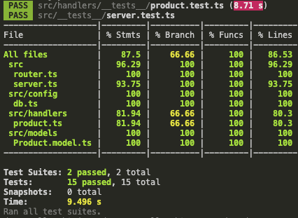
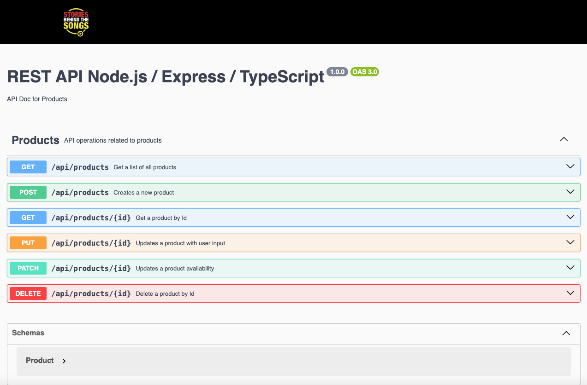

# SERVER - REST API NODE - Typescrip ( PERN )
A server in Node that connects to an API in PostgreSQL - Node / Typescript Server - Express ( PERN )
## Technologies
Node + TypeScript + Sequelize + Express
Testing tests with Jest + Super Test
API documented by Swagger
## Developer Notes

* Tested with Jest, Super Test, and Code Coverage and documented with swagger and swagger-ui

### API documented with swagger - PERN Stack
#### src/router.ts
```
import { Router } from "express";
import { createProduct, deleteProduct, getProductById, getProducts, updateAvailability, updateProduct } from "./handlers/product";
import { param } from "express-validator";

const router = Router()

/**
 * @swagger
 * components:
 *      schemas:
 *          Product:
 *              type: object
 *              properties:
 *                  id:
 *                      type: integer
 *                      description: The Product ID
 *                      example: 1
 *                  name:
 *                      type: string
 *                      description: The Product name
 *                      example: Monitor curvo - OLED
 *                  price:
 *                      type: integer
 *                      description: The Product price
 *                      example: 300
 *                  availibility:
 *                      type: boolean
 *                      description: The Product availability
 *                      example: true
 */
router.get('/', getProducts )
/**
 * @swagger
 * /api/products:
 *      get:
 *          summary: Get a list of all products
 *          tags: 
 *              - Products
 *          description: Return a list of products
 *          responses: 
 *              200:
 *                  description: Successful response
 *                  content:
 *                      application/json:
 *                          schema:
 *                              type: array
 *                              items:
 *                                  $ref: '#/components/schemas/Product'
 */

router.get('/:id', 
    param('id').isInt().withMessage('ID no válido'),
    getProductById
 )

/**
 * @swagger
 *  /api/products/{id}:
 *      get:
 *          summary: Get a product by Id
 *          tags:
 *              - Products
 *          description: Return a product based on its unique Id
 *          parameters:
 *              - in: path
 *                name: id
 *                description: The Id on the product
 *                required: true
 *                schema:
 *                  type: integer
 *          responses:
 *              200: 
 *                  description: Successful response
 *                  content:
 *                      application/json:
 *                          schema:
 *                              $ref: '#/components/schemas/Product'
 *              404:
 *                  description: Not found
 *              400:
 *                  description: Invalid Id
 */
    

router.post( '/' ,
    createProduct 
)

/**
 * @swagger
 *  /api/products:
 *      post:
 *          summary: Creates a new product
 *          tags:
 *              - Products
 *          description: Return a new record in a Database
 *          requestBody:
 *              required: true
 *              content:
 *                  application/json:
 *                      schema:
 *                          type: object
 *                          properties:
 *                              name:
 *                                  type: string
 *                                  example: Monitor curvo de 49 pulgadas
 *                              price:
 *                                  type: number
 *                                  example: 339
 *          responses:
 *              201: 
 *                  description: Successful response
 *                  content:
 *                      application/json:
 *                          schema:
 *                              $ref: '#/components/schemas/Product'
 *              400:
 *                  description: Invalid Id
 */


router.put( '/:id' ,
    param('id').isInt().withMessage('ID no válido'),
    updateProduct 
)
/**
 * @swagger
 *  /api/products/{id}:
 *      put:
 *          summary: Updates a product with user input
 *          tags:
 *              - Products
 *          description: Return the updated product
 *          parameters:
 *              - in: path
 *                name: id
 *                description: The Id on the product
 *                required: true
 *                schema:
 *                  type: integer
 *          requestBody:
 *              required: true
 *              content:
 *                  application/json:
 *                      schema:
 *                          type: object
 *                          properties:
 *                              name:
 *                                  type: string
 *                                  example: Monitor curvo de 49 pulgadas
 *                              price:
 *                                  type: number
 *                                  example: 339
 *                              availibility:
 *                                  type: boolean
 *                                  example: true
 *          responses:
 *              200: 
 *                  description: Successful response
 *                  content:
 *                      application/json:
 *                          schema:
 *                              $ref: '#/components/schemas/Product'
 *              400:
 *                  description: Invalid Id
 *              404:
 *                  description: Product not found
 */


router.patch( '/:id' ,
    param('id').isInt().withMessage('ID no válido'),
    updateAvailability 
)

/**
 * @swagger
 *  /api/products/{id}:
 *      patch:
 *          summary: Updates a product availability
 *          tags:
 *              - Products
 *          description: Return the updated availability
 *          parameters:
 *              - in: path
 *                name: id
 *                description: The Id on the product
 *                required: true
 *                schema:
 *                  type: integer
 *          responses:
 *              200: 
 *                  description: Successful response
 *                  content:
 *                      application/json:
 *                          schema:
 *                              $ref: '#/components/schemas/Product'
 *              400:
 *                  description: Bad Request - Invalid Id
 *              404:
 *                  description: Product not found
 */

router.delete( '/:id' ,
    param('id').isInt().withMessage('ID no válido'),
    deleteProduct
)
/**
 * @swagger
 *  /api/products/{id}:
 *      delete:
 *          summary: Delete a product by Id
 *          tags:
 *              - Products
 *          description: Returns a string confirming the deletion of the product
 *          parameters:
 *              - in: path
 *                name: id
 *                description: The Id on the product
 *                required: true
 *                schema:
 *                  type: integer
 *          responses:
 *              200: 
 *                  description: Product eliminated
 *                  content:
 *                      application/json:
 *                          schema:
 *                              type: string
 *                              value: 'Product eliminated'
 *                 
 *              400:
 *                  description: Bad Request - Invalid Id
 *              404:
 *                  description: Product not found
 */


export default router
```
